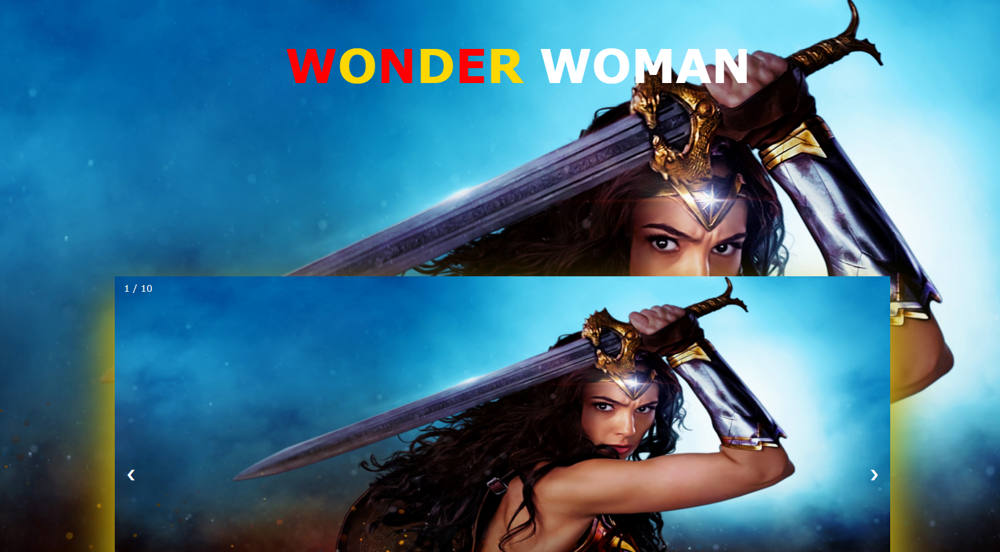
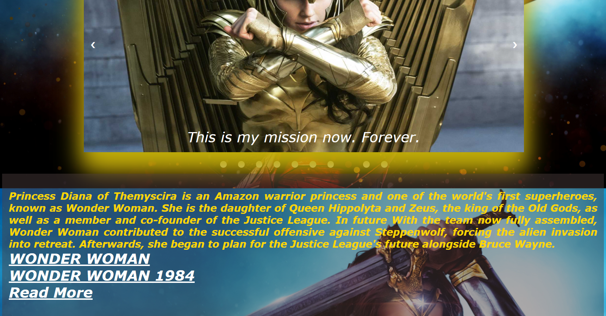

***This new Web is created by Ankita Sikder, students of BTECH, in University of Engineering and Management, Kolkata.***

***Email Id: ankita.sikder14@gmail.com.***

***Contact No: 8583939774.***

# WONDER-WOMAN-WEBPAGE :star_struck: :open_mouth: :sunglasses: :facepunch:

  

## About :point_down:

     

***LINK : :point_right: 
  
## Why I have made this :point_down:

## Some Resources of this project :point_down:

     
I have used basic concepts of web development to make this web application. I have used HTML5, CSS3 and JAVASCRIPT only. I have used slider, card, polaroid, table, figure, row column concepts for designing. I have used animations for text, slideshow designing.  
I have used _[marvel fandom wiki]_(https://marvelcinematicuniverse.fandom.com/wiki/Marvel_Cinematic_Universe) for references of every avengers' characters. In the home page in marvel studious I have used this link for _[avengers' bio]_(https://www.marvel.com/characters).I have used _[hotstar]_(https://www.hotstar.com/in) for movie links.

     
## Some Screenshots of this project :point_down:

     
 

